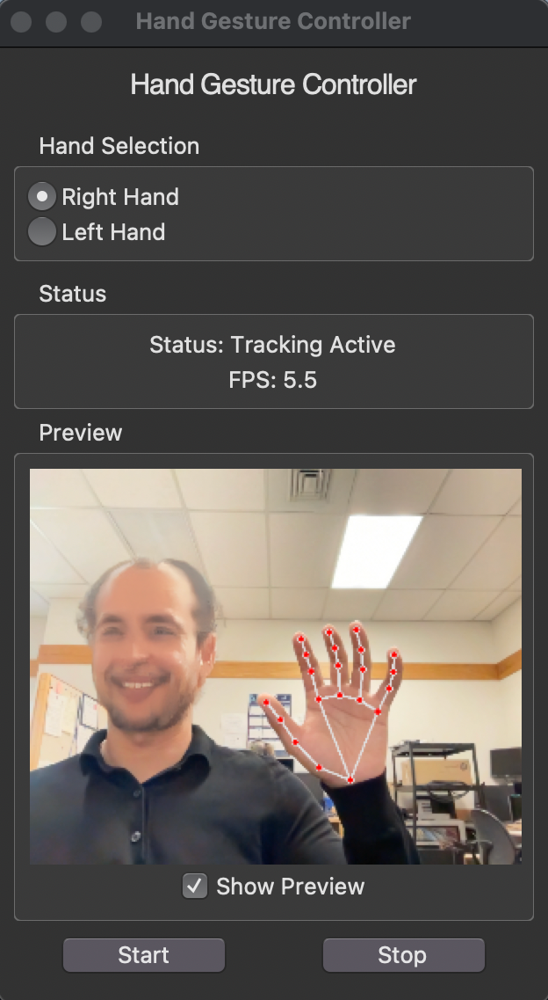

# Hand Gesture Controller

A Python application that enables computer control through hand gestures using computer vision. The application tracks hand movements through your webcam and translates them into mouse controls.

## Features

- Real-time hand tracking and gesture recognition
- Mouse movement control using index finger
- Click, right-click, and drag gestures
- Scrolling functionality
- Live camera preview option
- FPS counter
- Hand preference selection (left/right)

## Gestures

- Move cursor: Point with index finger
- Click: Pinch index finger and thumb
- Right-click: Pinch middle finger and thumb
- Drag: Pinch index, middle finger and thumb
- Scroll: Two fingers up/down motion
- Start tracking: Show all fingers
- Stop tracking: Close all fingers

## Installation

1. Clone this repository
```bash
git clone https://github.com/hashim1213/HandTrackMouse.git
```
2. Set up environment 
```bash
python3 -m venv venv
source venv/bin/activate

//Windows 
`venv\Scripts\activate`
```
3. Install dependencies:
```bash
pip install -r requirements.txt
```

## Usage

1. Run the application:
```bash
python HandTrack.py
```

2. Select your preferred hand (left/right)
3. Click "Start" to begin hand tracking
4. Optional: Enable camera preview to see hand tracking visualization

## Requirements

- Python 3.8+
- Webcam
- Sufficient lighting for hand detection

##Screenshot of GUI


